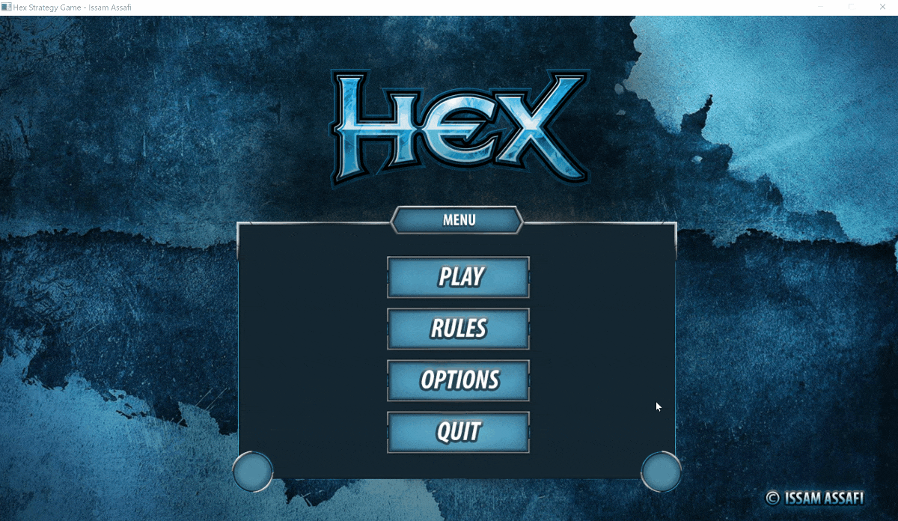

# HexGame - Strategy Board Game

## Description

A GUI and command line C++ implementation of [Game of Hex](http://en.wikipedia.org/wiki/Hex_(board_game)), with an intuitive user interface and a simple AI algorithm. It's a project that was created as a part of the *Programming Techniques* course at University of California, Santa Cruz.

This program requires C++11 support, which is not provided by older versions of g++. It has been tested successfully using g++ v4.4.6 and v4.8.0.

## Platforms

HexGame is built using the SDL2 API. See the SDL website - [http://www.libsdl.org](http://www.libsdl.org/) for more information about SDL itself.

HexGame SDL runs on Linux,, Windows, Mac OS X, and other platforms.

## Screenshots / Preview



## Prerequisites

This program uses SDL 2.0 alongside the following libraries : SDL_image and SDL_Mixer :

### **SDL 2.0**

```
https://www.libsdl.org/download-2.0.php
```

### **SDL_image**

```
https://www.libsdl.org/projects/SDL_image
```

### SDL_mixer 2.0

```
https://www.libsdl.org/projects/SDL_mixer/
```